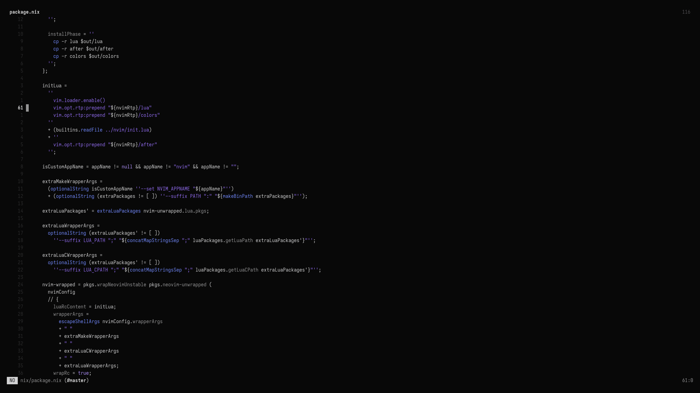
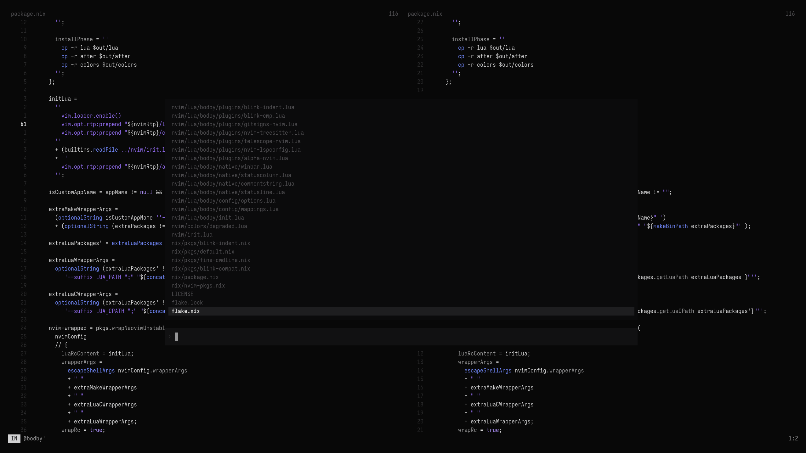
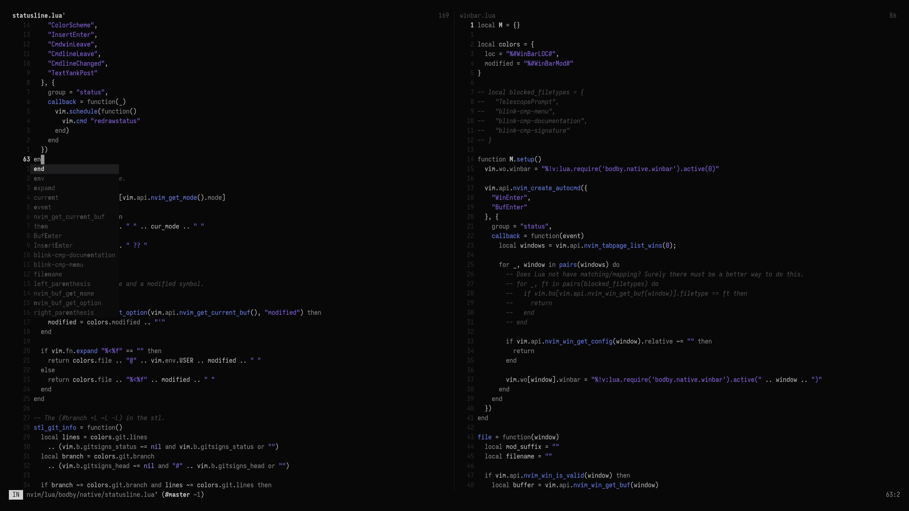

# degraded.nvim

Neovim colorscheme.

Plugin support is currently not a thing, and neither are LSP highlights; only Treesitter as of right now.

See `colors/degraded.lua` for a list of setup options (line 2-24).

## Screenshots

